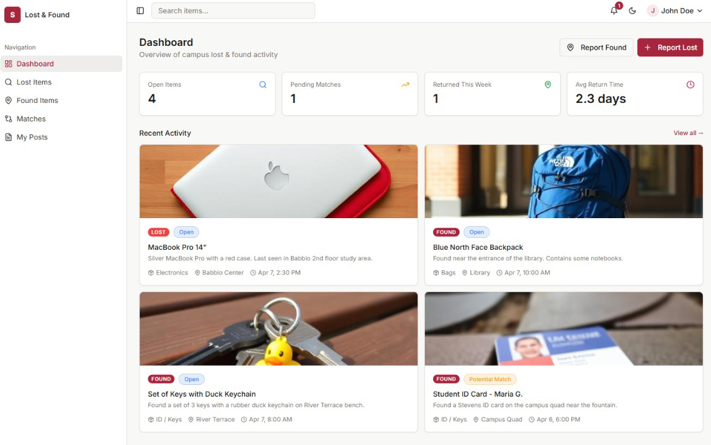

# Stevens Lost and Found 🎓🔍



> A modern, intuitive campus lost & found platform built specifically for the Stevens Institute of Technology community to effortlessly report, track, and match missing items.

## 🌟 Features

- **🔐 User Authentication:** Secure access to ensure campus community integrity.
- **📊 Interactive Dashboard:** A quick overview of campus-wide lost and found statistics.
- **🤝 Smart Match Center:** Automatically identifies potential matches between reported lost items and recently found items.
- **📝 Post Lost & Found Items:** Easy-to-use forms (powered by React Hook Form & Zod) to upload items with images, descriptions, and location details.
- **🔍 Dedicated Feeds:** Browse separated feeds for both "Lost" and "Found" items, allowing for quick scanning.
- **🛠️ Admin Panel:** Dedicated tools for administrators to manage posts, users, and overall platform health.
- **🌗 Light & Dark Theme:** Built-in theme toggle for a tailored visual experience.
- **📱 Fully Responsive:** Carefully crafted with Tailwind CSS to look great on desktop, tablet, and mobile browsers.

## 🛠️ Tech Stack

This project is built with modern web technologies, prioritizing performance, type safety, and developer experience:

- **Framework:** [React 18](https://reactjs.org/) + [Vite](https://vitejs.dev/)
- **Language:** [TypeScript](https://www.typescriptlang.org/)
- **Styling:** [Tailwind CSS](https://tailwindcss.com/)
- **UI Components:** [shadcn/ui](https://ui.shadcn.com/) (built on [Radix UI](https://www.radix-ui.com/))
- **Icons:** [Lucide React](https://lucide.dev/)
- **Routing:** [React Router v6](https://reactrouter.com/)
- **State & Data Fetching:** [React Query (@tanstack/react-query)](https://tanstack.com/query/latest)
- **Forms & Validation:** [React Hook Form](https://react-hook-form.com/) + [Zod](https://zod.dev/)
- **Charts:** [Recharts](https://recharts.org/)

## 🚀 Getting Started

Follow these steps to set up the project locally.

### Prerequisites

- [Node.js](https://nodejs.org/) (v18 or higher recommended)
- `npm` (or `yarn` / `pnpm`)

### Installation

1. **Clone the repository:**
   ```bash
   git clone https://github.com/your-username/stevens-item-connect.git
   cd stevens-item-connect
   ```

2. **Install dependencies:**
   ```bash
   npm install
   ```

3. **Run the development server:**
   ```bash
   npm run dev
   ```

4. **Open your browser:**
   Navigate to `http://localhost:5173` to see the application in action.

## 📦 Scripts

- `npm run dev` - Starts the Vite development server.
- `npm run build` - Builds the application for production using TypeScript and Vite.
- `npm run preview` - Locally preview the production build.
- `npm run lint` - Runs ESLint to identify and fix code issues.
- `npm run test` - Runs the Vitest test suite.

## 📂 Project Structure

```text
src/
├── assets/        # Static assets like images and fonts
├── components/    # Reusable UI components (including shadcn/ui components)
├── contexts/      # React Context providers (Auth, Theme)
├── data/          # Mock data and constants
├── hooks/         # Custom React hooks
├── lib/           # Utility functions (e.g., Tailwind class merging)
├── pages/         # Route level components/views
├── test/          # Testing utilities and configurations
├── App.tsx        # Main application component & routing setup
├── main.tsx       # React DOM entry point
└── index.css      # Global styles & Tailwind directives
```
